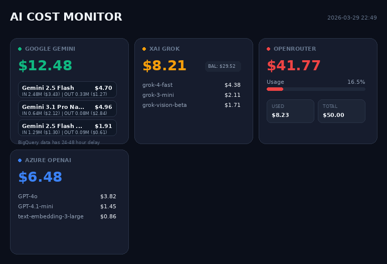
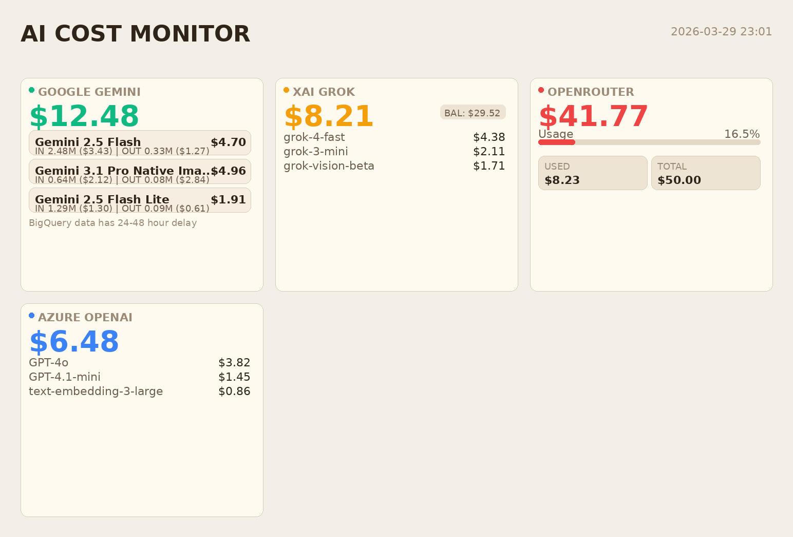
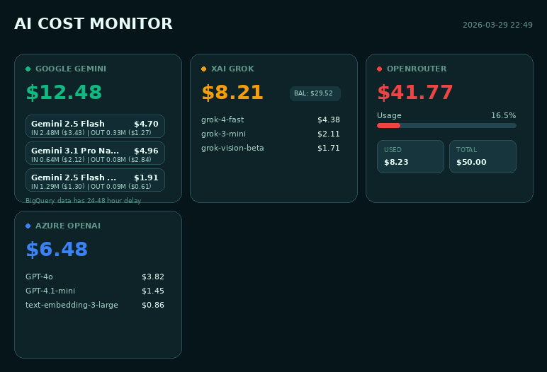

# AI Cost Monitor - AstrBot Plugin

AI 服务费用查询插件，支持多种 AI 服务的费用查询和报告生成。

当前版本重点改进：

- 使用 `Pillow` 直接绘制报告图片，不再依赖 `playwright` 和浏览器运行时
- 根据已启用的 provider 动态聚合卡片，不再固定为 Gemini、Grok、OpenRouter 三张
- 只查询已完成配置的模块，减少无效请求和等待时间
- 支持多种报告风格切换，可在配置中选择预览样式
- 支持自定义字体与更高渲染倍率，便于做清晰度和风格微调

## 支持的服务

- **Azure OpenAI** - 通过 Cost Management API 查询本月费用（弃用）
- **OpenRouter** - 查询账户余额和使用情况
- **Google Gemini** - 通过 BigQuery 查询 Gemini API 费用
- **xAI Grok** - 查询账户余额和使用情况

## 安装

1. 安装依赖：
```bash
pip install -r requirements.txt
```

2. 在 AstrBot 插件目录中放置此插件

## 配置

在 AstrBot 管理面板中配置以下参数：

### 通用配置
| 参数 | 说明 |
|------|------|
| `enable_daily_report` | 启用每日定时报告 |
| `report_time` | 每日报告时间 (HH:MM) |
| `report_targets` | 每日报告发送目标列表 |
| `report_style` | 报告样式，可选 `midnight` / `paper` / `aurora` |
| `report_scale` | 图片渲染倍率，推荐 `2` 或 `3` |
| `report_font_file` | 自定义字体文件，支持 `ttf` / `otf` / `ttc` |

### 图片质量控制
| 参数 | 默认值 | 说明 |
|------|--------|------|
| `t2i_image_type` | "jpeg" | 报告图片格式，可选 `jpeg` 或 `png` |
| `t2i_image_quality` | 70 | 报告图片质量（仅 JPEG 有效），范围 10-100 |
| `t2i_scale` | "device" | 页面缩放设置，可选 `css` 或 `device` |
| `t2i_full_page` | true | 渲染完整页面（而非仅视口大小） |

#### 图片质量控制说明

报告图片渲染时可控制以下参数：

- **`t2i_image_type`**: 选择图片格式
  - `jpeg`: 文件更小，适合网络传输
  - `png`: 支持透明背景，文件较大
- **`t2i_image_quality`**: JPEG 图片质量（10-100）
  - 推荐 60-90，数值越高质量越好但文件越大
- **`t2i_scale`**: 页面缩放设置
  - `device`: 使用设备缩放设置，适合高分屏
  - `css`: CSS像素对应设备分辨率，高分屏截图变小
- **`t2i_full_page`**: 是否渲染完整页面
  - `true`: 渲染完整内容页面
  - `false`: 仅渲染视口大小

### Azure OpenAI（弃用）
| 参数 | 说明 |
|------|------|
| `azure_tenant_id` | Azure 租户 ID |
| `azure_client_id` | Azure 客户端 ID |
| `azure_client_secret` | Azure 客户端密钥 |
| `azure_subscription_id` | Azure 订阅 ID |

### OpenRouter
| 参数 | 说明 |
|------|------|
| `openrouter_api_key` | OpenRouter API Key |

### Google Cloud
| 参数 | 说明 |
|------|------|
| `google_project_id` | Google Cloud 项目 ID |
| `google_bq_table` | BigQuery 账单表地址 |
| `google_service_account_json` | 服务账号 JSON 文件路径 |

### xAI
| 参数 | 说明 |
|------|------|
| `xai_api_key` | xAI API Key |
| `xai_team_id` | xAI Team ID |

## 使用

发送命令：
```
/aicost
```

插件会只查询“已配置完成”的服务，并根据启用模块动态生成图片报告。

例如：

- 仅配置了 `google_project_id` 与 `google_bq_table`，则只展示 Google Gemini 卡片
- 配置了 Google、xAI、OpenRouter，则报告中会动态展示 3 张对应卡片
- 如果额外配置了 Azure，则会自动增加 Azure OpenAI 卡片

## 报告样式

可以通过 `report_style` 切换报告风格：

- `midnight` - 深色仪表盘风格
- `paper` - 浅色账单卡片风格
- `aurora` - 青绿色霓虹风格

也可以通过以下配置进一步调整显示效果：

- `report_scale` - 提高清晰度，倍率越高输出图越清晰
- `report_font_file` - 上传自定义字体后，报告会优先使用该字体绘制

### 预览图

#### Midnight Grid



#### Paper Ledger



#### Aurora Pulse



## 注意事项

1. **Google BigQuery** 需要：
   - 在 Google Cloud Console 中启用 BigQuery API
   - 导出账单数据到 BigQuery
   - 配置服务账号权限

2. 图片报告使用 `Pillow` 直接绘制，不再依赖 `playwright` 和浏览器运行时。

3. 模块启用逻辑基于配置完整性自动判断：
   - Google 需要 `google_project_id` 和 `google_bq_table`
   - xAI 需要 `xai_api_key` 和 `xai_team_id`
   - OpenRouter 需要 `openrouter_api_key`
   - Azure 需要完整的租户、客户端、密钥和订阅配置

4. 若未启用任何 provider，插件会返回明确错误，提示先完成至少一个模块配置。

5. 若配置了 `report_font_file`，插件会优先使用上传字体；未配置时自动回退到系统默认字体。
